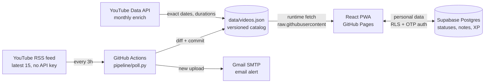

# 🌳 MoneyTree

A personal mentor-tracking app for the [Grace Ofure Zone](https://www.youtube.com/@graceofure). It catalogues all 895+ of her YouTube videos (plus guest appearances), emails me the moment she uploads, and tracks my own learning journey: watched status, reflections, book notes, assignments and an XP-powered money tree that grows as I learn.

Built as a real data-engineering system on a budget of exactly **€0.00**.


## Why

I follow Grace Ofure to grow my financial and investment knowledge. YouTube's own notifications kept failing me, her content lives across five platforms, and I wanted one place that answers: what has she made, what have I watched, and what did I learn from it?

## Architecture



Two kinds of data, two stores, chosen by who writes them:

- **Catalogue data** (her videos, books, appearances) is written by the pipeline and lives as JSON in this repo. Git history gives free versioning, and the app fetches it at runtime from `raw.githubusercontent.com`, so a data commit updates the app in minutes with no rebuild.
- **Personal data** (watched status, reflections, XP ledger) is written by the app and lives in Supabase Postgres behind row-level security. The anon key ships in the bundle by design; RLS is the lock.

Design details worth noting:

- The poller is **idempotent**: no new videos means a byte-identical file, no commit, no email. Tested in `pipeline/tests/test_diff.py`.
- `first_seen_at` (pipeline stamp), not `published_at`, drives NEW badges, so a backfill can never explode into 895 false alerts.
- The XP ledger is append-only with a partial unique index, so the same video can never award points twice.
- Keyless fallbacks everywhere: yt-dlp backfill and radar when there is no API key, bundled data snapshot when offline, localStorage watermark when signed out.

## Stack

**Pipeline** Python (feedparser, requests), pytest, GitHub Actions cron.
**App** Vite, React, TypeScript, Tailwind, TanStack Query, Supabase JS, PWA (Workbox).
**Hosting** GitHub Pages + Supabase free tier. Total cost: nothing.

## Run it locally

```bash
# pipeline
python -m venv .venv
.venv/Scripts/pip install -r pipeline/requirements-dev.txt
.venv/Scripts/python -m pytest pipeline/tests
.venv/Scripts/python -m pipeline.backfill_ytdlp   # keyless full catalogue

# app
cd frontend
npm install
npm run dev
```

Personal tracking needs a Supabase project: see [SETUP.md](SETUP.md).

## Roadmap

- [x] **P1** Video library, new-upload alerts, watch status, reflections
- [x] **P2** Books, chapter notes, action items with due dates
- [x] **P3** Social and community log, assignments with private PDF storage
- [x] **P4** Her Moves: events and programmes with countdowns
- [x] **P5** Dashboard: growing money-tree mascot, streaks, 13 badges, XP chart, confetti, and an unskippable Saturday quiz built partly from the user's own watch history and notes, graded A to F
- [x] **Guest radar** `pipeline/radar.py` searches YouTube for her appearances on other channels (API in CI, yt-dlp locally) and merges them into the catalogue monthly
- [x] **Wealth Word** one curated finance or real-estate term a day (72 in the bank), marked as learned, fed back into the Saturday quiz, and used as the farm's tech tree
- [x] **Money Farm** a pure-function idle economy in `frontend/src/lib/farm.ts`: learning mints the salary (XP x €10), assets with real cash-flow and appreciation behaviour, loans, temptations, weekly Market Day with events and deal cards carrying hidden title, seller and flood risks that due diligence reveals; win = passive income covers living costs
- [ ] v2 parking lot: Facebook auto-check, Telegram alerts, Power BI over the Postgres
